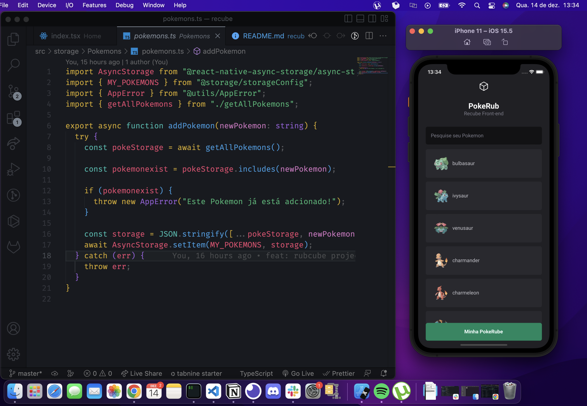
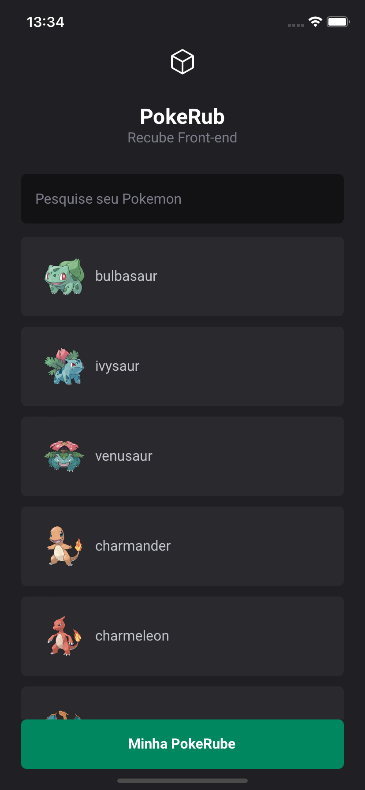
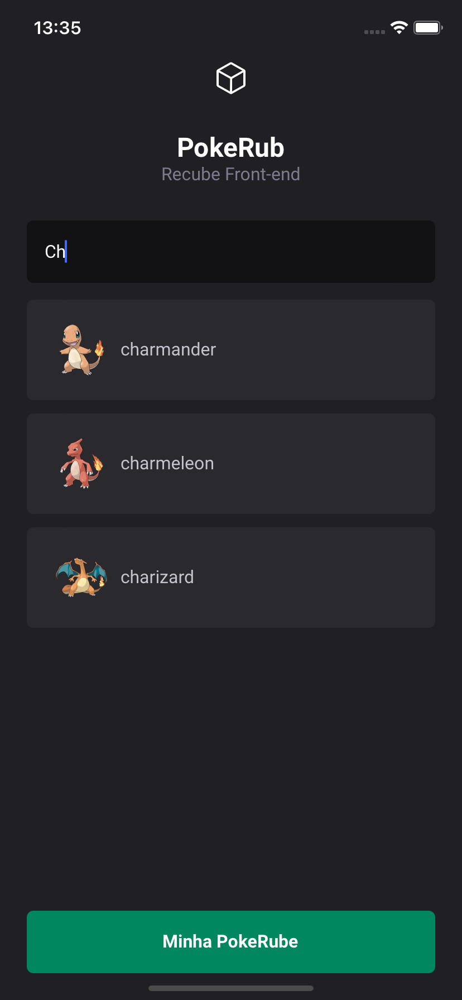
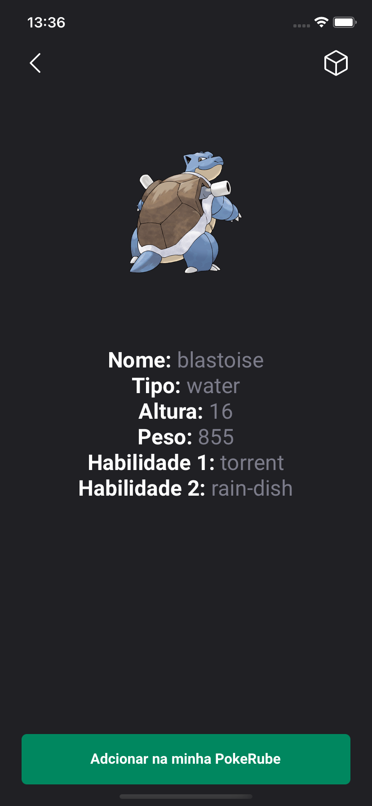
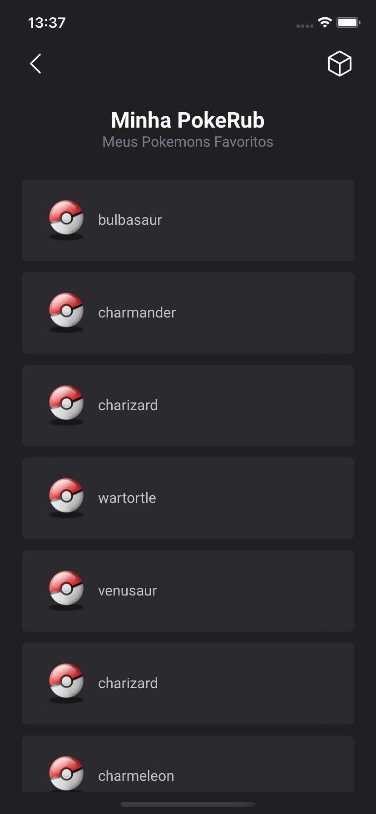

<h1>RubCube</h1>

> Status: concluído 🚀

### Desafio para desenvolvedor front-end para - Rubcube

https://github.com/Rubcube/hiring-exercises/

### Descrição

> Este exercício consiste em implementar a melhor solução possível para um dos exercícios abaixo no tempo previsto. Estamos avaliando sua capacidade de atender a um conjunto de requisitos e criar uma solução completa que demonstre habilidade, consideração e atenção à experiência do usuário. Este NÃO é um teste de quão bem você conhece Android ou iOS ou React, nem deve tentar nos impressionar com soluções muito complexas. Se você quer nos impressionar, construa algo bonito, intuitivo e fácil de depurar/testar/estender 🫡.

> dealmente, sua solução teria alguma maneira de ser executada localmente e visualizar os resultados em um emulador para que possamos analisar totalmente a experiência e não apenas o código-fonte.

### PokeRub

Requisitos
Listagem de ingressos:

- Eu como usuário do PokeRub, quero visualizar todos os pokemons existentes por nome, havendo a possibilidade de filtrar pelo nome e consultar suas características (tipo, altura, peso, categoria e habilidades), para entendermos do que o pokemon é capaz.
- Eu como usuário do PokeRub, quero poder visualizar quais evoluções são possíveis de um pokemon específico, havendo a possibilidade de evoluir o pokemon se desejado para que eu tenha o pokemon evoluído.
- Eu como usuário do PokeRub, quero salvar meus pokemons favoritos em uma lista a parte para que eu possa consultar sempre que desejado.

### Tecnologias

- React Native
- Typescript
- Expo

### Adicionais

- Api de ser consumida para o desafio segue abaixo

> Documentation: https://pokeapi.co/docs/v2#items-section

---

# 🎨 Layout

O layout da aplicação foi desenvolvido por mim mesmo

### Visão App PokeRub

### Home - PokeRub

A tela principal home lista todos os pokemons, contém uma barra de pesquisa para buscar por nome o pokemon desejado.

### O usuário pode pesquisar por nome o pokemon desejado

Ao digitar na barra de pesquisa um pokemon é feito um filtro entres os pokemons.

### About - PokeRub / Usuário pode ver detalhes do Pokemon clicado

Nesta tela contém detalhes do pokemon clicado.

### PokeRube - Meus Pokemons favoritos armazenados

Nesta tela contém os pokemons armazenados no asyncStorage do dispositivo.

Como executar o projeto 🚀

#### Clone este repositório :

> git clone git@github.com:danrleyney2210/rubcube_desafio.git

#### Acesse a pasta do projeto no seu terminal/cmd:

> cd rubcube_desafio

#### check se esta na banch main

#### Instalando dependências :

> yarn

### ou

> npm install

### Execute a aplicação em modo de desenvolvimento

> expo start

# 🛠 Dependências

> Principais biblioteca usadas no projeto: 🔥

- @expo/vector-icons@13.0.0 - Biblioteca de icones.

- Styled Components - CSS-in-js

- expo-font - Fontes de texto.

- Eslint - Ferramenta para identificar e relatar os padrões encontrados no código ECMAScript / JavaScript, com o objetivo de tornar o código mais consistente e evitar bugs.

- Axios - Cliente HTTP baseado em promessa para node.
  jse o navegador.

Veja o arquivo <a>package.json</a>

> Utilitários

- Editor: Visual Studio Code

---

### Informações exigidas pelo teste

> Pergunta: O exercício que você escolheu e o porque, caso exista mais de uma opção de teste para a vaga :
> Resposta : Escolhi este exercíco porque demostraria mais habilidade e domínio nas tecnologia exigidas.

> Pergunta: como testar e rodar a aplicação?
> Resposta Ao clonar o repositório, secute o comando yarn ou npm i, para instalar as dependências. e logo em seguida executar o comando expo start. Para mais informações verfique o arquivo package.json.

> Pergunta: qualquer observação que você sentiu durante o processo se algo foi difícil de fazer, confuso, frustrante.
> Resposta: Nenhuma observação, teste foi trnaquilo e objetivo.

> Pergunta: qualquer coisa que você quer nos dizer sobre o processo
> Resposta: Na minha opnião em um teste não precisa exigir em um Readme respostas de perguntas não relacionada ao teste, isso seria melhor na entrevista após passar no teste para melhor entrevista. O outro ponto seria ter um layou ou figma para o candidado seguir, isso avaliaria sua habilidade no front-end.

> Pergunta: o que você adicionaria se tivesse mais tempo?
> Resposta: Adcionaria um contexto para gerenciamento de estado apenas para demonstração e domínio de habilidade.

### 🦸 Desenvolvedor 🤘

Feito com ❤️ por Danrley Ney 👋🏽 Entre em contato!

> Email: danrley.dev@gmail.com

> Twitter: @danrleyney
